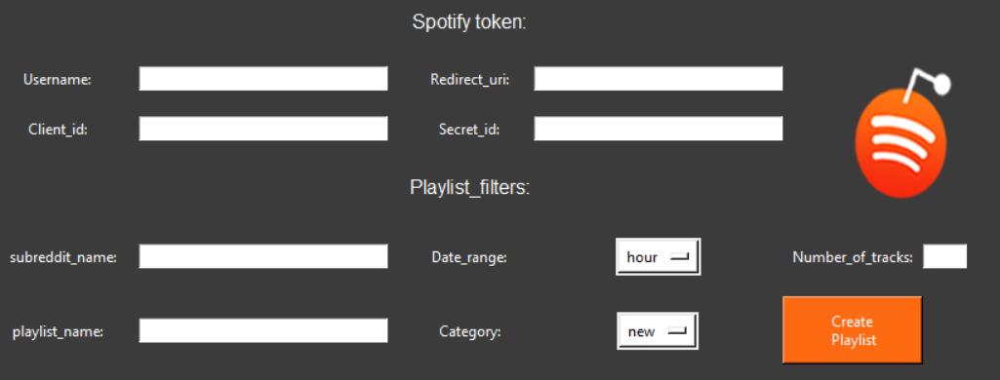

<p align="center">

</p>

<p align="center">

 
 
</p>


Reddify Creates a Spotify playlist, based on the top posts of a specific music genre subreddit, Based on [Spotipy](https://spotipy.readthedocs.io/en/2.19.0/) and [Praw](https://praw.readthedocs.io/en/stable/). 


**Features:**

- Eazy to use GUI
- Generates a playlist based on your personal preferences.
- Multiple playlist filters.


**Playlist filters options:**

- **Playlist name** : The name you choose for your playlist.
- **Subreddit name**: The name of the subreddit which you want to extract your posts from
- **Number of tracks** : the number of track you would like to have in your playlist
- **Date range**: sorts reddit top posts by a specific date range: (past day, past week, .... all time).


## Requierments:

- spotipy
- praw
- tkinter 


## User guide:

In order to create your playlist, you first need to get authorization from Reddit and Spotify (tokens).

1. To get the Spotify token, create an app in [Spotify for developers dashboard](https://developer.spotify.com/dashboard/applications), and retrive your:
 - client id 
 - secret id 
 - set up a redirect URL 

2. To get the Reddit token, create an app in [Reddit prefernces](https://www.reddit.com/prefs/apps/), and retrive your:
- client id 
- client_secret
- user agent


Now, we are ready to use reddify.
Download the repository and run: ```main.py ```

Enter your information into the GUI:
<p align="center">
  
</p>

Thats it!

if you filled up your information correctly, your playlist should appear on Spotify.
